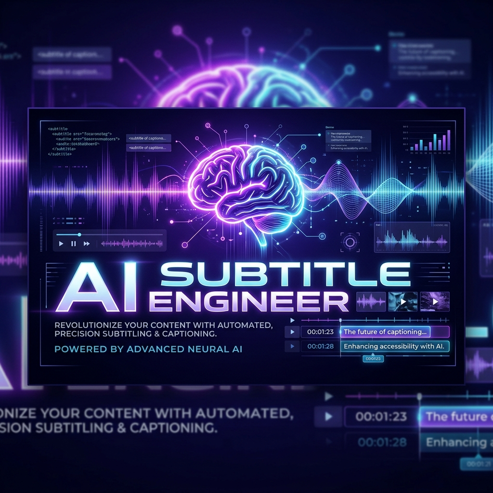



  

# 🎬 AI Subtitle Engineer | 旗艦級影片字幕自動化工具

一套專為高效能、高品質設計的自動化工具。支援 **網址下載** 與 **影片上傳** 雙模式。
不但整合了 **Faster-Whisper (ASR)** 語音辨識技術，更自動翻譯並修正為 **台灣繁體中文口語**。

---

## 🌟 核心特色 (Core Features)

### 🤖 極速 AI 轉錄靈魂 (Powered by Whisper)
- **硬體加速轉錄 (GPU)**：使用 large-v3 模型配合 int8_float16 量化技術。辨識速度比傳統 Whisper 快 5-10 倍。
- **自動 VAD 靜音過濾**：內建精準語音活動偵測 (VAD)，徹底告別「幻聽」字母，減少字幕冗餘。
- **自動語系偵測**：支援超過 90 種語言，若未指定則自動識別母體語言。

### 🌍 台灣在地化翻譯系統
- **地道台灣口語**：針對語意進行語氣優化，而非生硬字對字翻譯。
- **自動繁簡用語修正**：內建 zhconv 詞庫，自動將「軟體、硬碟、軟體」等轉化為台灣標準規範字。
- **雙語對照輸出**：直接產出 professional 定義的雙語 SRT，方便剪輯與觀看。

### 🎨 現代化旗艦級 Web UI
- **玻擬態設計 (Glassmorphism)**：使用毛玻璃效果與深色漸層，營造未來科技感。
- **雙模式輸入切換**：
  - **🔗 網址模式**：直接貼上 YouTube, X, FB, IG 連結，系統自動下載音軌。
  - **📁 檔案模式**：拖放本地影片檔案進行上傳，支援多人非同步任務。
- **SSE 實時日誌監控**：網頁端直接收看後端 ASR 進度與日誌流，任務狀態一目了然。

## 🛠️ 環境安裝 (Setup Guide)

### 第一步：環境準備
請確保您的系統已安裝 **Python 3.10** 與 [FFmpeg](https://ffmpeg.org/download.html)。

### 第二步：安裝依賴套件
`ash
pip install -r requirements.txt
`

### 第三步：啟動服務 (2 選 1)
#### 🐳 推薦：Docker 一鍵啟動 (GPU 支援)
`ash
docker build -t ai-subtitle-engineer .
docker run --gpus all -p 8000:8000 ai-subtitle-engineer
`

#### 💻 本地 Python 運行
`ash
python main.py
`
> **存取路徑**：請在瀏覽器開啟 http://localhost:8000。

---

## 🕹️ 核心指令 (CLI / Web)

| 參數 | 說明 |
| :--- | :--- |
| --url | 影片網址 (YouTube, X, FB, IG) |
| --model | ASR 模型規格 (small / medium / large-v3) |
| --lang | 指定原始語系 (en, ja, zh) |
| --output | 字幕輸出檔名 |

---
*Built with Faster-Whisper & Antigravity.*